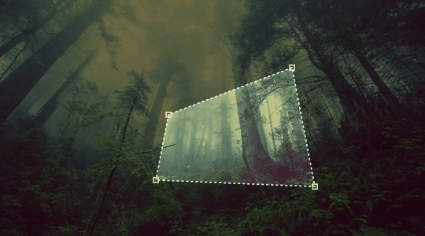

# React-lasso-select

A responsive react tool for marking irregular areas in images (lasso / free select). No dependencies!

[](https://www.npmjs.com/package/react-lasso-select)




## Demos

- [Simple demo](https://codesandbox.io/s/react-lasso-select-issue2-h92hn?file=/src/App.tsx)

- [Demo with typescript](https://codesandbox.io/s/react-lasso-select-demo-using-typescript-and-react-hooks-kddyt)

- [Advanced demo](https://codesandbox.io/s/react-lasso-select-advanced-demo-g0yn4?file=/src/App.tsx)

## Features

- Responsive (you can change image size even while selecting!)
- Touch events support
- Keyboard support for precise selection
- No dependencies

## Installation

With yarn:

```bash
yarn add react-lasso-select
```

With npm:

```bash
npm i react-lasso-select
```

## Usage

Import the main js module:

```js
import ReactLassoSelect from 'react-lasso-select';
```

## Example

```jsx
import { useState } from 'react';
import ReactLassoSelect, { getCanvas } from 'react-lasso-select';

export default function App () {
  const src = './demo.jpg';
  const [points, setPoints] = useState([]);
  const [clippedImg, setClippedImg] = useState();
  return (
    <div className="App">
      <ReactLassoSelect
        value={points}
        src={src}
        onChange={value => {
          setPoints(value);
        }}
        onComplete={value => {
          if (!value.length) return;
          getCanvas(src, value, (err, canvas) => {
            if (!err) {
              setClippedImg(canvas.toDataURL());
            }
          });
        }}
      />
      <div>
        Points: {points.map(({x, y}) => `${x},${y}`).join(' ')}
      </div>
      <div>
        
      </div>
    </div>
  );
}
```

## Props

Most important props:

- `src` (string) (required) Specifies the path to the image (or base64 string)
- `value` (array of  {x: number, y: number}) Specifies input value
- `onComplete(path)` Callback fired every time path has been closed / updated / reset (use it for better performance insead of `onChange`)
- `onChange(path)` Callback fired every time path has been changed (ex. point added/removed/replaced)

Props related to component:

- `disabled` (boolean, default false) Set to true to block selecting
- `style` (object) CSS style attributes for component container
- `viewBox` ({width: number, height: number}) Viewbox attribute for svg element, avoid changing the default value.

Props related to image:

- `imageAlt` (string) Specifies an alternate text for the image, if the image for some reason cannot be displayed
- `crossOrigin` (string) CrossOrigin attributes for image element
- `imageStyle` (object) CSS style properties for image
- `onImageLoad(event)` A callback which happens when the image is loaded
- `onImageError(event)` Callback called when image is unable to load

## Difference between `onChange` and `onComplete` props in terms of dragging

- `onChange` is triggered with every little movement while dragging points
- `onComplete` runs at the end of a drag, so it's better to use it for better performance

## Tips for better user experience

There are some extra features made to improve user experience.

1. Press CTRL (Meta Key on Mac) while selecting area to straighten the path from the last point. (Keep the angle of 15 degrees)

2. Press CTRL + SHIFT keys to maintain parallelism to another sides.

## Contributing / Developing

Feel free to post any PR or issues. Be here for information on features, bug fixes, or documentation.

To develop clone this repository and run `npm i -D` and `npm run build`, this will create a `lib` folder with compiled files. I suggest you test your changes before PR with `npm link` and `create-react-app` & `npm link react-lasso-select` in another directory.
